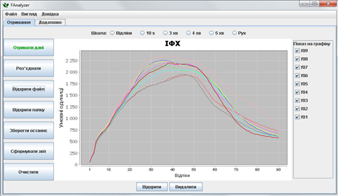

FAnalyzer - це програма для роботи з кривими індукції флуоресценції хлорофілу (ІФХ), які були виміряні приладом "Флоратест" (Інститут кібернетики ім. В.М. Глушкова НАН України). Програма дозволяє: отримувати дані від приладів "Флоратест", візуалізувати результати вимірювання, об'єднати різні вимірювання в один файл, обчислити основні параметри кривих ІФХ та записати криві, їх параметри та статистичні показники у файл звіту у форматі CSV.

Для коректної роботи FAnalyzer необхідно наявність встановленої java. Для цього запустіть командний рядок і введіть команду "java". Якщо напише, що команда не розпізнана, то встановіть java (файл [java8-jre-8u181-windows-x64](https://www.dropbox.com/t/4nJgxgc1f2IQCLdg) або більш новіший дистрибутив з [офіційного сайту Oracle](https://www.oracle.com/java/technologies/javase-jre8-downloads.html)).

Якщо не працює кнопка "З'єднання", що відповідає за роботу з Com-портом і отримання даних з приладу Floratest, то можливе не співпадіння розрядності встановленої java із розрядністю деяких бібліотек FAnalyzer (тобто це означає, що для 64 розрядної версії програми FAnalyzer необхідно, щоб була встановлена 64 розрядна версія Java). Перевірити версію  java можна набравши в командному рядку java -vertion

